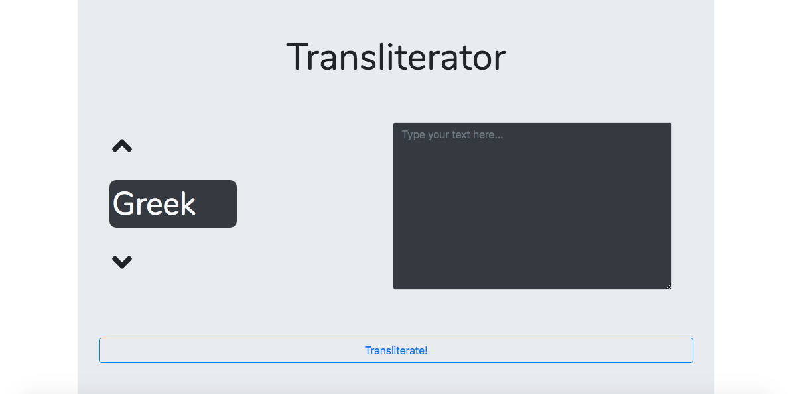

# Greek and Hebrew Transliterator
For transliterating large chunks of Greek and Hebrew text (and eventually with support for Syriac)

## Technologies
Golang Echo framework on the backend, Vue and Bootstrap for the UI. Backend uses template rendering to serve the UI. Vue, Bootstrap, FontAwesome, jQuery, and Nunito font through CDN. In order to avoid clashes between `{{ }}` syntax in Echo and Vue, ``{{ `{{ dataProperty }}` }}`` allows Vue to render its data properties within Echo template.

To serve static files (js and css), set up static route through [Echo#Static()](https://echo.labstack.com/guide/static-files): `e.Static("/static", "assets")`. This will serve static files through `href` attribute on `<link>` tag or `src` on `<script>` from `asset` directory at "/static/css/index.css" or "/static/js/index.js".

## UI
